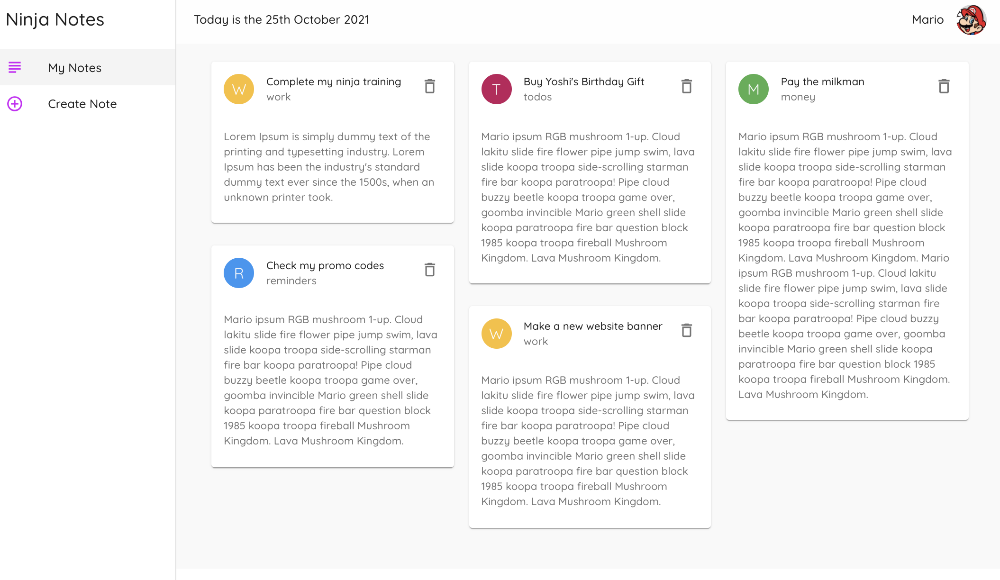
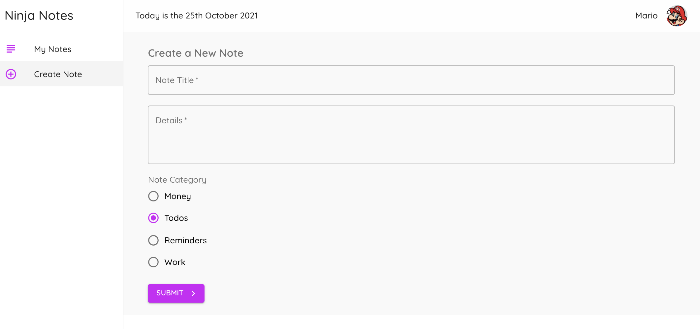

### Starter Project for the Material UI playlist

Download the code & run **npm install** to install dependencies before starting the app.

You'll also need to install Material UI as a dependency. To do this run **npm install @material-ui/core**

## mui-notes

This app is to practice learning Material UI for React.





|                                         |                                         |                                                   |
| :-------------------------------------: | :-------------------------------------: | :-----------------------------------------------: |
|       [Introduction](#mui-notes)        | [Table of Contents](#table-of-contents) | [Development Highlights](#development-highlights) |
|      [Installation](#installation)      |    [Page Directory](#page-directory)    |       [Code Hightlights](#code-highlights)        |
| [Technologies Used](#Technologies-Used) |           [Credits](#Credits)           |                [License](#License)                |

## Development Highlights

- Create custom theme and provided to the react components.
- Create a Layout that includes an AppBar, Toolbar, and Drawer.
- Use useStyles React hooks for dynamic CSS.

## Installation

1. Download dependencies.

```
npm i
```

2. Start JSON server

```
json-server --watch data/db.json --port 8000
```

3. Start app.

```
npm start
```

## Page-Directory

The custom theme is created in the App.js.

There is a pages folder and components folder to organize the react files.

## Code Highlights

Create custom theme.

```JavaScript
const theme = createMuiTheme({
  palette: {
    primary: {
      main: '#fefefe'
    },
    secondary: purple
  },
  typography: {
    fontFamily: 'Quicksand',
    fontWeightLight: 400,
    fontWeightRegular: 500,
    fontWeightMedium: 600,
    fontWeightBold: 700
  }
})
```

Use style hooks.

```JavaScript
const useStyles = makeStyles({
  field: {
    martingTop: 20,
    marginBottom: 20,
    display: "block"
  }
})
```

## Technologies

- [react](https://reactjs.org/)
- [mui](https://mui.com/)

## Credits

This app followed the Material UI [tutorial](https://www.youtube.com/watch?v=0KEpWHtG10M&list=PL4cUxeGkcC9gjxLvV4VEkZ6H6H4yWuS58) by The Net Ninja.

|                           |                                                                                                                                                                                                       |
| ------------------------- | ----------------------------------------------------------------------------------------------------------------------------------------------------------------------------------------------------- |
| **David Anusontarangkul** | [ LinkedIn](https://www.linkedin.com/in/anusontarangkul/) [ GitHub](https://github.com/anusontarangkul) |

## License

[](https://opensource.org/licenses/MIT)
